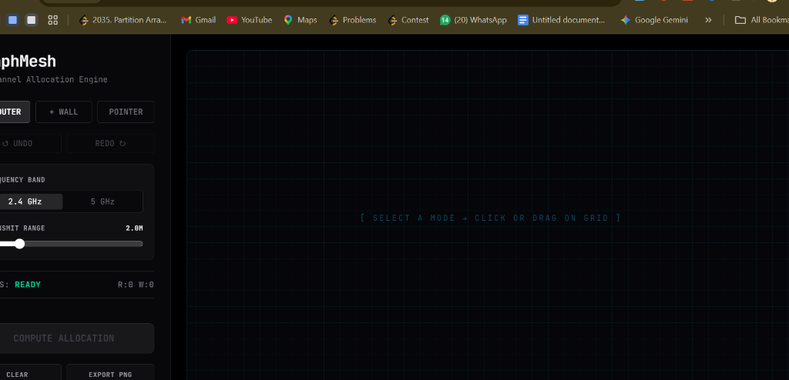
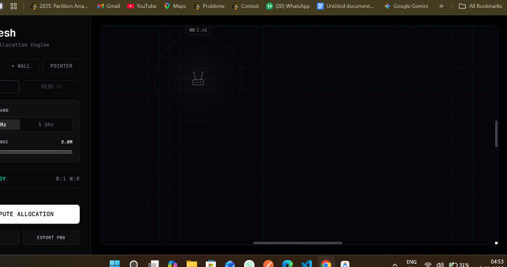

# 🌐 GraphMesh

**High-Performance RF Channel Allocation & Wi-Fi Interference Simulation Engine**

[](https://graphmesh-2.onrender.com/)

GraphMesh is a full-stack engineering tool designed to simulate Wi-Fi router placements, model physical wall attenuations, and automatically resolve RF channel conflicts using graph theory. 

It utilizes a modern React frontend seamlessly bridged to a high-performance C++ compute engine via Node.js Inter-Process Communication (IPC).

## 📸 Previews

### Professional Zinc Interface


### Router Placement & Frequency Assignment


*(Note: Test the live demo to see the newly integrated Canvas Ray-Casting Heatmaps!)*

---

## ✨ Key Features

- **C++ Compute Engine:** Heavy mathematical calculations (computational geometry, line-segment intersections) are offloaded to a compiled C++ binary for maximum performance.
- **Greedy Graph Coloring:** Automatically allocates non-overlapping Wi-Fi channels (e.g., 1, 6, 11 for 2.4GHz, and 36, 40, 44... for 5GHz) to routers based on their interference graph.
- **Dual-Band Support & RF Physics:** Supports both 2.4 GHz and 5 GHz bands. The physics engine accurately applies different attenuation penalties depending on wall materials (Concrete, Wood, Glass) and the selected frequency.
- **Ray-Casting Signal Heatmaps:** Built entirely with the HTML5 Canvas API, the frontend visually renders realistic Wi-Fi coverage areas and casts accurate shadows (dead-zones) behind walls.
- **Custom File Format & IPC:** Frontend states are serialized into JSON and piped (`stdin/stdout`) into the C++ engine running in a persistent backend container.

## 🛠️ Tech Stack Architecture

**1. Frontend (The User Interface)**
- **Next.js & React:** For reactive state management and interactive drag-and-drop canvas layout.
- **TailwindCSS:** For the enterprise-grade dark zinc aesthetic and glassmorphism components.
- **HTML5 Canvas & SVG:** SVG handles sharp vector lines for walls/connections, while Canvas handles computationally heavy pixel-perfect raycasted shadows.

**2. Backend Bridge (The Middleware)**
- **Node.js (Next.js API Routes):** Acts as the Backend-For-Frontend (BFF).
- **Child Process (`spawn`):** Securely spawns the native C++ executable, bypassing typical Serverless OS-level restrictions by running inside a containerized environment (Render).

**3. Core Engine (The Brain)**
- **Modern C++:** Handles all intensive algorithms, preventing Node.js from blocking the main thread during heavy mathematical calculations.
- **nlohmann/json:** For robust JSON parsing in C++.

## 🚀 Local Development

### Prerequisites
- Node.js (v18+)
- C++ Compiler (g++ or MSVC)

### Setup

1. **Clone the repository:**
   ```bash
   git clone https://github.com/Ajaythakur000/GraphMesh.git
   cd GraphMesh
   ```

2. **Compile the C++ Engine:**
   ```bash
   cd engine
   g++ -O3 main.cpp -o engine.exe
   cd ..
   ```

3. **Install dependencies and run frontend:**
   ```bash
   cd frontend
   npm install
   npm run dev
   ```
4. Open [http://localhost:3000](http://localhost:3000) in your browser.

## 🧠 Why C++ over pure JavaScript?
While V8 is incredibly fast, modeling highly dense Wi-Fi mesh networks requires parsing hundreds of ray-cast line-intersections per frame. By decoupling the visualization (React) from the math (C++), the UI thread remains completely unblocked, allowing smooth 60FPS dragging of routers even while the interference graph is being computed.
